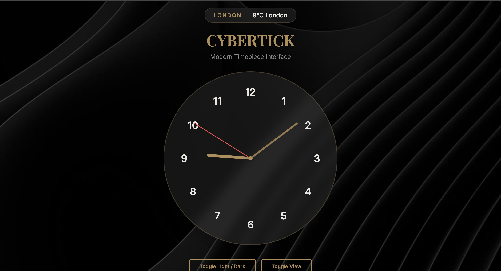
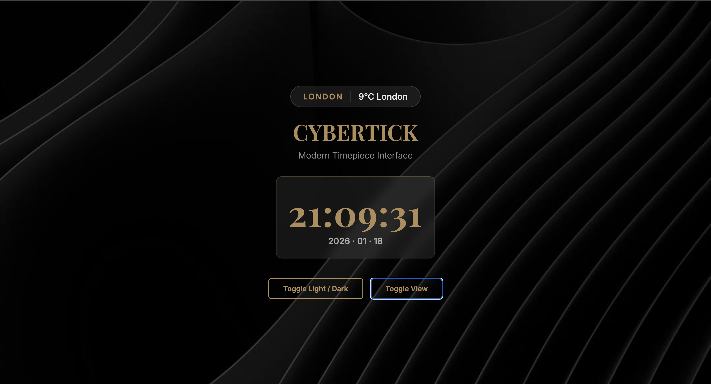
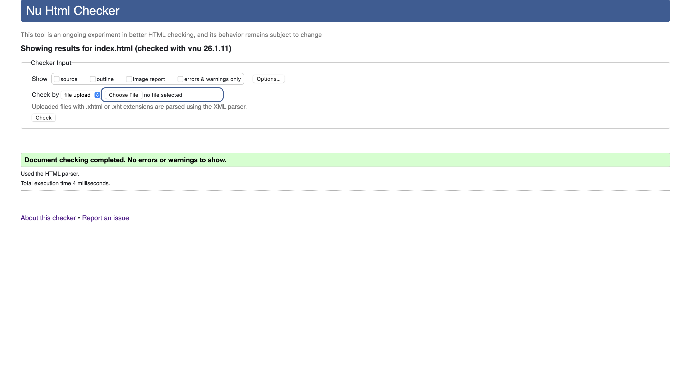
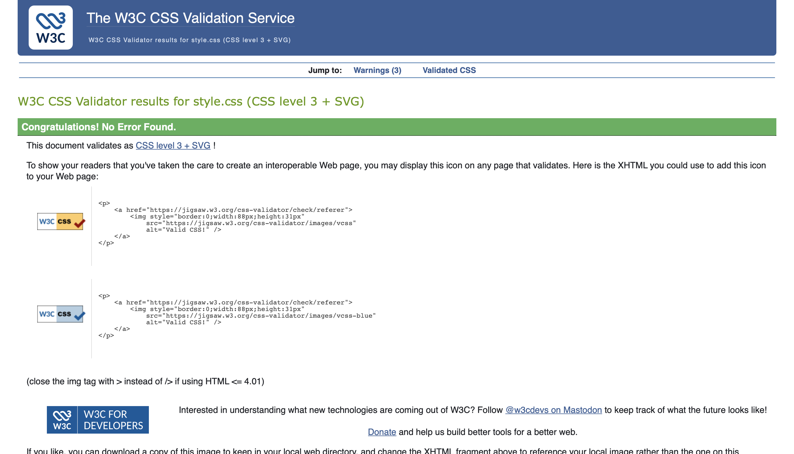

# 🕒 CyberTick  
**Modern Timepiece Interface · Glassmorphism UI · Focus-Oriented Design**

👉 **[Explore the Live Project](https://github.com/Ayinuer/CyberTick)**

---

## 📌 Project Overview
**CyberTick** is a premium, responsive web application designed to deliver a distraction-free timekeeping experience.  
It combines elegant **Glassmorphism aesthetics** with functional utility, offering both **Analog and Digital clock modes**, alongside a **Lockdown-style focus overlay** designed to support deep work and concentration.

The project focuses on:
- Clean visual hierarchy
- Smooth UI transitions
- Semantic and accessible HTML
- Maintainable, modular CSS architecture

---

## 📋 Table of Contents
- 🎯 [Project Goals & Vision](#-project-goals--vision)
- 🖼️ [Screenshots & UI Preview](#️-screenshots--ui-preview)
- 💻 [Tech Stack & Design System](#-tech-stack--design-system)
- ✅ [W3C Validation & Quality Assurance](#-w3c-validation--quality-assurance)
- 📱 [Responsive Design & UX Details](#-responsive-design--ux-details)
- 🧩 [User Stories & Core Features](#-user-stories--core-features)
- 🤖 [Use of AI in This Project](#-use-of-ai-in-this-project)
- 🛠️ [Setup & Local Development](#️-setup--local-development)

---

## 🎯 Project Goals & Vision

| Category | Description |
|--------|-------------|
| **Core Mission** | Deliver a clean, elegant, and distraction-free time interface with optional focus-lockdown functionality. |
| **Target Users** | Developers, designers, students, and professionals who value aesthetics and productivity. |
| **Design Philosophy** | Minimalist, glass-based UI with subtle micro-interactions and balanced layout. |

---

## 🖼️ Screenshots & UI Preview

> 📌 *All screenshots are taken from the current build of CyberTick.*

### 🕰️ Analog Mode
 

### 💻 Digital Mode
 


### 🌙 Theme Toggle (Light / Dark)
  (

📁 **Screenshots directory:** `/screenshots`

---

## 💻 Tech Stack & Design System

### Technology Stack
- **HTML5** — Semantic and accessible structure
- **CSS3** — Modular styling with Glassmorphism (`backdrop-filter`)
- **JavaScript (ES6)** — Time logic, UI state management
- **Bootstrap 5** — Responsive layout system
- **Typography** — Garamond (Display), Inter (UI)

---

### 🎨 Color Palette (CSS Variables)

| Variable | Value | Purpose |
|--------|-------|---------|
| `--primary-gold` | `#FFD700` | Brand highlights and clock hands |
| `--bg-dark` | `#0a0a0a` | Dark mode background |
| `--glass-bg` | `rgba(255,255,255,0.1)` | Glass UI panels |
| `--text-light` | `#f4f4f4` | Secondary text |

---

## ✅ W3C Validation & Quality Assurance

CyberTick follows modern web standards and has been formally validated.

### Validation Results
- ✅ **W3C HTML Validation** — Passed
- ✅ **W3C CSS Validation** — Passed
- ✅ **Accessibility Checks** — Semantic landmarks applied

### Validation Evidence
  


---

## 📱 Responsive Design & UX Details

| Area | Feature | Implementation |
|-----|--------|----------------|
| Layout | Mobile-first design | Bootstrap Grid + Flexbox |
| UI Style | Glassmorphism | `backdrop-filter: blur(10px)` |
| Analog Clock | Hand rotation | CSS transforms + JS Date API |
| Controls | Micro-interactions | Hover lift & transitions |

---

## 🧩 User Stories & Core Features

| User Need | Feature Delivered |
|---------|------------------|
| Immediate feedback | Time visible on page load |
| Visual preference | Analog / Digital toggle |
| Focus sessions | Lockdown-style overlay |
| Low-light usage | Dark mode support |

---

## 🤖 Use of AI in This Project

Artificial Intelligence tools were used as **assistive development resources**, similar to documentation or technical references, while maintaining full developer responsibility.

### How AI Supported the Development Process

| Area | AI Contribution |
|-----|----------------|
| **UI & Layout Design** | Suggested improvements to spacing, alignment, and visual hierarchy based on modern UI/UX practices. |
| **CSS Architecture** | Assisted with refining CSS variables, theming strategy, and Glassmorphism effects. |
| **JavaScript Logic Review** | Helped validate time calculations using the JavaScript `Date` object and clock-hand rotation logic. |
| **Accessibility & Semantics** | Recommended semantic HTML elements and ARIA attributes to improve accessibility. |
| **Documentation** | Assisted in structuring a professional README and improving technical clarity. |

### Developer Responsibility & Verification

All AI-generated suggestions were:
- Critically reviewed before implementation  
- Manually tested in the browser  
- Adapted to meet project requirements  
- Integrated with original developer-written code  

The final design, logic, and testing decisions remain **fully authored and verified by the developer**.

### Learning Outcomes from AI Collaboration
- Stronger understanding of UI hierarchy and layout systems
- Improved CSS theming and maintainable styling practices
- Better documentation and technical communication skills
- Practical experience using AI as a **professional development tool**

---

## 🛠️ Setup & Local Development

```bash
git clone https://github.com/Ayinuer/CyberTick.git
cd CyberTick
open index.html